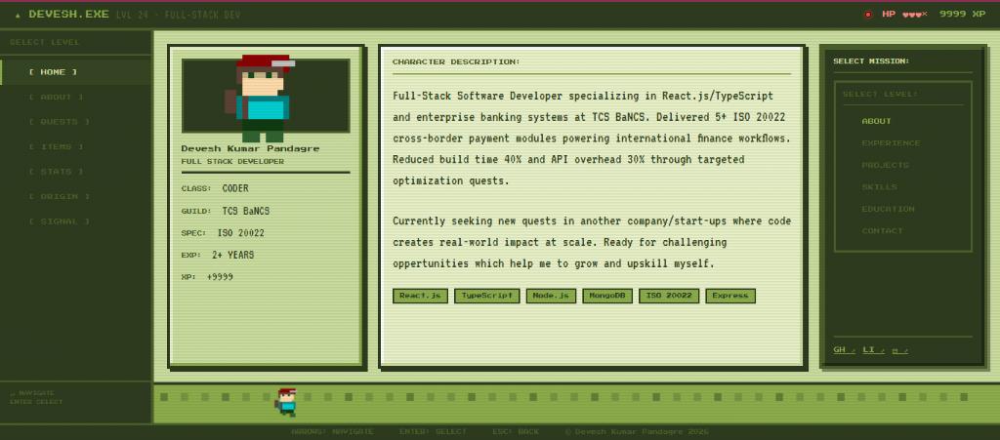
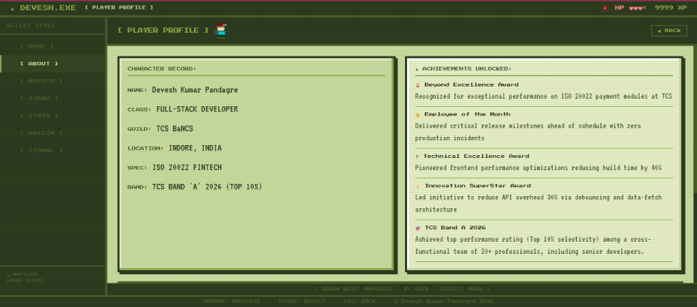

# 🎮 MyPixelPortfolio

A interactive, retro GameBoy-themed pixel art personal portfolio. The application mimics a classic handheld console where visitors can explore a software developer's career journey, skills, and projects through retro-styled UI controls and animated transitions.

---

## 📸 Screenshots

### Home Console Screen


### Character Record (About Page)


---

## ✨ Features

- **Dynamic Hero Sprite Transitions**: The player character scales and animatedly walks between the main menu tabs, seamlessly transitioning to inner page headers when selections are clicked.
- **Chunky GameBoy Aesthetics**: Styled using custom pixelated borders, retro CRT glass overlay effects, custom scanlines, and authentic pixel fonts (`Press Start 2P` and `VT323`).
- **Interactive Quests (Projects)**: Projects are styled as adventure quests with progress bars, rewards, stats, and custom icons.
- **Character Record (About)**: Visualizes career details as classic character stats, guild levels, and unlocked achievements.
- **Guild Signals (Contact Form)**: Visitors can send messages (guild invitations) which are transmitted to the backend Express server, saved to MongoDB, and sent as email alerts.
- **Fully Responsive**: Scaled pixel aesthetics optimized to fit desktop screens and adapt to mobile devices cleanly.

---

## 🛠️ Tech Stack

- **Frontend**: React (TypeScript), Vite, CSS Variables (Custom Retro Color Palettes).
- **Backend**: Node.js, Express, Mongoose (MongoDB).
- **Deployment**: Configured for deployment on Vercel and Render/Railway.

---

## 🚀 Getting Started

### Prerequisites
- [Node.js](https://nodejs.org/) (v18 or higher)
- [MongoDB](https://www.mongodb.com/) (Local or Atlas database)

### Installation

1. Clone the repository:
   ```bash
   git clone https://github.com/dev-kp-eloper/my-pixel-portfolio.git
   cd my-pixel-portfolio
   ```

2. Install dependencies for the root, frontend, and backend packages:
   ```bash
   npm install
   ```

3. Configure Environment Variables:

   Create a `.env` file in the `server` directory:
   ```env
   PORT=5000
   MONGO_URI=your_mongodb_connection_string
   EMAIL_USER=your_gmail_address
   EMAIL_PASS=your_gmail_app_password
   ```

   *(Optional)* Create a `.env` file in the `client` directory to point to your hosted backend:
   ```env
   VITE_API_URL=http://localhost:5000
   ```

---

## 💻 Running the Application

To run both the Vite client dev server and the Express API server concurrently:

```bash
npm run dev
```

- **Frontend Console**: `http://localhost:5173/`
- **Backend API**: `http://localhost:5000/`

---

## 📦 Production Builds

To compile production-ready bundles:

### Build Client
```bash
npm run build:client
```
The static files will build into `client/dist`.

### Build Server
```bash
npm run build:server
```
The compiled Javascript will build into `server/dist`.
